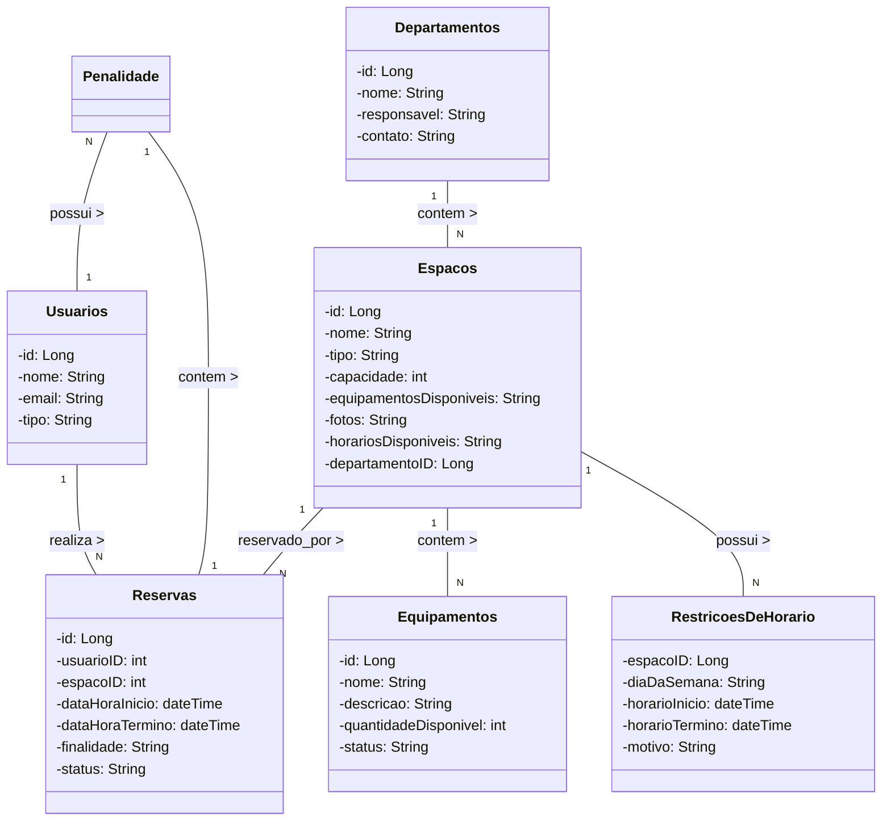
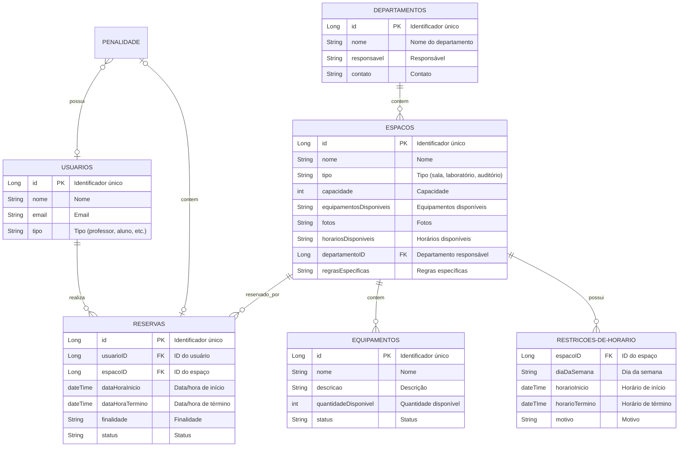

Select a language: [Português](#sistema-de-reservas-de-espaços-em-universidade) | [English](#university-space-reservation-system)

## Sistema de Reservas de Espaços em Universidade

O objetivo é permitir a gestão simples e pratica de reserva de espaços, como salas, laboratórios, auditórios e equipamentos, em uma universidade. O sistema deve é capaz de gerenciar departamentos, usuários com diferentes papéis, treinamentos, equipamentos, restrições de horário, conflitos de agendamento, feedbacks e relatórios.

## Diagrama de Classes UML

## Diagrama ER

## Principais Funções do Sistema:

- **Gestão de Usuários:** Adição e configuração de novos usuários, definição de papéis e permissões.

- **Gestão de Departamentos:** Criação e manutenção de departamentos, associação de responsáveis e espaços.

- **Gerenciamento de Espaços e Equipamentos:** Atualização de espaços e equipamentos, manutenção de disponibilidade e regras.

- **Gestão de Reservas:** Supervisão do processo de reserva, resolução de conflitos e aplicação de penalidades.

- **Reserva de Espaços:** Possibilidade de usuários autorizados realizarem reservas, com verificação automática de disponibilidade.

- **Gestão de Autorizações:** Capacidade de professores e funcionários administrativos autorizarem reservas a outros usuários.

- **Alocação Dinâmica de Equipamentos:** Usuários podem solicitar equipamentos ao reservar espaços.

- **Histórico de Utilização:** Registro detalhado das reservas e coleta de feedback.

- **Análise e Relatórios:** Geração de relatórios sobre utilização dos espaços e condição dos equipamentos.

- **Sistema de Penalidades:** Imposição de penalidades para usuários que não utilizam espaços reservados.

- **Integração com Calendário Acadêmico:** Disponibilidade de espaços ajustada automaticamente com base no calendário acadêmico.
