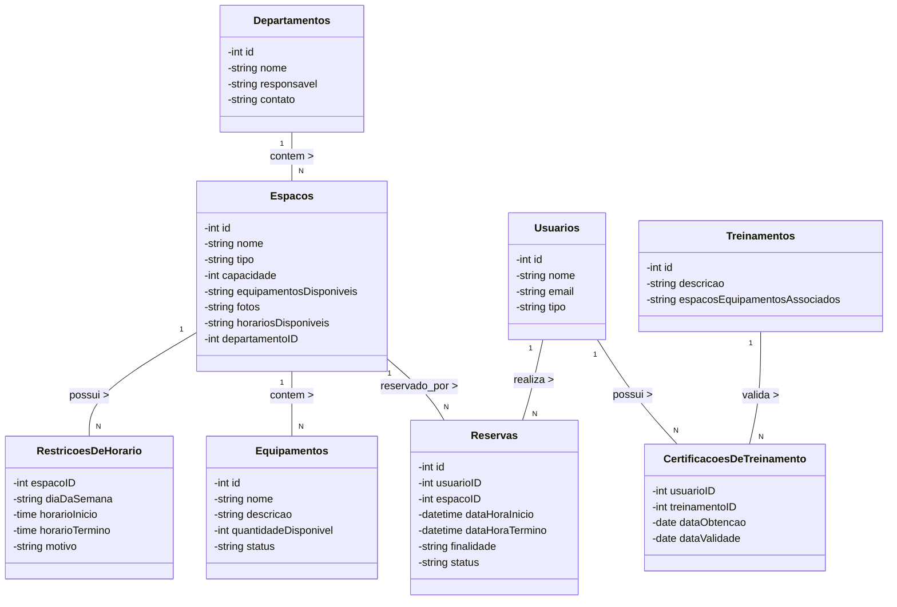
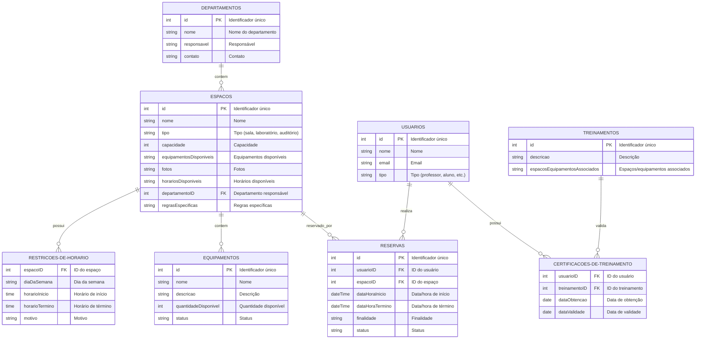
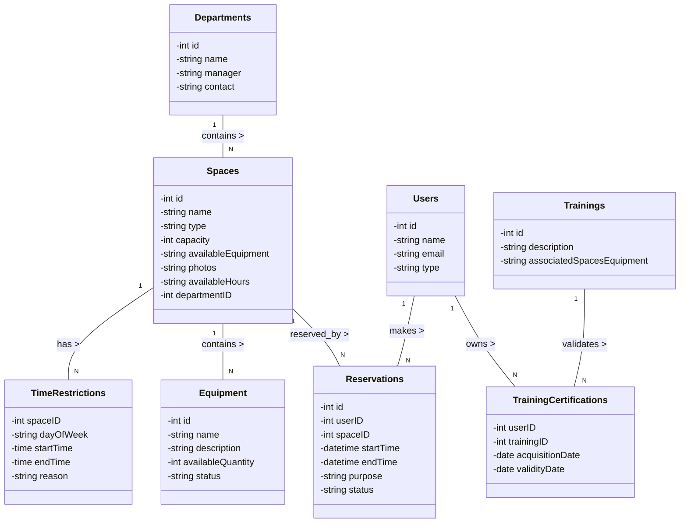
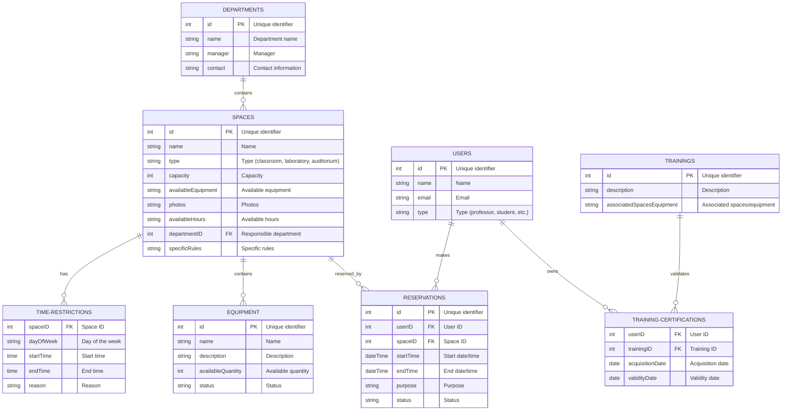

Select a language: [Português](#sistema-de-reservas-de-espaços-em-universidade) | [English](#university-space-reservation-system)

## Sistema de Reservas de Espaços em Universidade

O objetivo é permitir a gestão simples e pratica de reserva de espaços, como salas, laboratórios, auditórios e equipamentos, em uma universidade. O sistema deve é capaz de gerenciar departamentos, usuários com diferentes papéis, treinamentos, equipamentos, restrições de horário, conflitos de agendamento, feedbacks e relatórios.

## Diagrama de Classes UML

## Diagrama ER

## Principais Funções do Sistema:

- **Gestão de Usuários:** Adição e configuração de novos usuários, definição de papéis e permissões.

- **Gestão de Departamentos:** Criação e manutenção de departamentos, associação de responsáveis e espaços.

- **Gerenciamento de Espaços e Equipamentos:** Atualização de espaços e equipamentos, manutenção de disponibilidade e regras.

- **Gestão de Reservas:** Supervisão do processo de reserva, resolução de conflitos e aplicação de penalidades.

- **Reserva de Espaços:** Possibilidade de usuários autorizados realizarem reservas, com verificação automática de disponibilidade.

- **Gestão de Autorizações:** Capacidade de professores e funcionários administrativos autorizarem reservas a outros usuários.

- **Alocação Dinâmica de Equipamentos:** Usuários podem solicitar equipamentos ao reservar espaços.

- **Histórico de Utilização:** Registro detalhado das reservas e coleta de feedback.

- **Análise e Relatórios:** Geração de relatórios sobre utilização dos espaços e condição dos equipamentos.

- **Sistema de Penalidades:** Imposição de penalidades para usuários que não utilizam espaços reservados.

- **Integração com Calendário Acadêmico:** Disponibilidade de espaços ajustada automaticamente com base no calendário acadêmico.

## University Space Reservation System

The goal is to enable simple and practical management and reservation of spaces such as classrooms, laboratories, auditoriums, and equipment within a university. The system is capable of managing departments, users with different roles, training, equipment, time restrictions, scheduling conflicts, feedback, and reports.

### UML Class Diagram

### ER Diagram

### Key System Functions:

- **User Management:** Adding and configuring new users, defining roles and permissions.

- **Department Management:** Creating and maintaining departments, associating responsible parties and spaces.

- **Space and Equipment Management:** Updating spaces and equipment, maintaining availability and specific rules.

- **Reservation Management:** Overseeing the reservation process, resolving scheduling conflicts and enforcing penalties.

- **Space Reservation:** Authorized users can make reservations, with the system automatically checking for availability.

- **Authorization Management:** Professors and administrative staff can authorize other users to reserve specific spaces.

- **Dynamic Equipment Allocation:** Users can request equipment when making a reservation.

- **Usage History:** Detailed record of all reservations and collection of feedback.

- **Analysis and Reports:** Generation of reports on space utilization and equipment condition.

- **Penalty System:** Imposing penalties for users who make reservations but do not use the spaces.

- **Integration with Academic Calendar:** Automatic adjustment of space availability based on the academic calendar.

