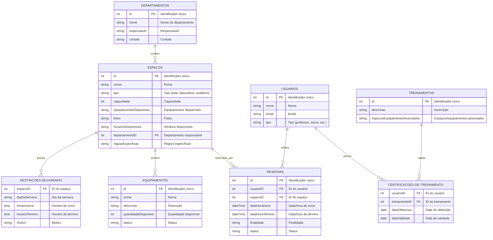

# Sistema Reservas de Espaços em Universidade

O objetivo é permitir a gestão simples e pratica de reserva de espaços, como salas, laboratórios, auditórios e equipamentos, em uma universidade. O sistema deve é capaz de gerenciar departamentos, usuários com diferentes papéis, treinamentos, equipamentos, restrições de horário, conflitos de agendamento, feedbacks e relatórios.

## Diagrama de Classes UML

Abaixo está o diagrama de classes UML do sistema:

## Diagrama ER

